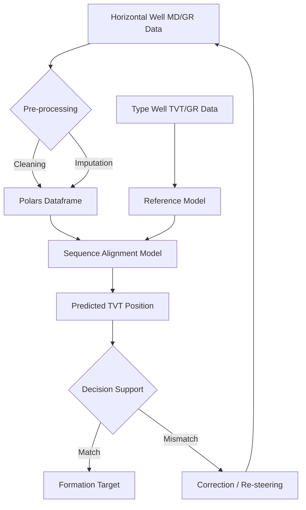

# Comprehensive Guide: Drilling Techniques and Geosteering Methods

This document provides a technical overview of oil well types, boring methods, and advanced geosteering techniques, with a specific focus on the methods applied in the ROGII Wellbore Geology Prediction challenge.

## 1. Types of Oil Wells

Oil and gas wells are classified based on their trajectory, purpose, and construction:

### 1.1 Vertical Wells
The traditional well type, drilled straight down into the reservoir.
- **Pros**: Simplest to drill and complete.
- **Cons**: Limited contact with the reservoir (only the vertical thickness of the pay zone).

### 1.2 Directional (Deviated) Wells
Wells drilled at an angle to reach targets not directly beneath the surface location.
- **Purpose**: Reaching offshore targets from onshore, avoiding surface obstacles, or drilling multiple wells from a single pad.

### 1.3 Horizontal Wells
A type of directional well where the trajectory is turned approximately 90 degrees to run parallel to the reservoir layer.
- **Pros**: Increases reservoir contact by orders of magnitude compared to vertical wells. Essential for unconventional shale reservoirs.
- **Cons**: High complexity in drilling and navigation (geosteering).

### 1.4 Multilateral Wells
A single "mother" wellbore with multiple lateral branches extending into different parts of the reservoir.

## 2. Boring and Drilling Techniques

### 2.1 Conventional Rotary Drilling
Uses a rotating drill string with a bit at the end. Drilling fluid ("mud") is circulated to cool the bit and carry cuttings to the surface.

### 2.2 Percussion (Cable Tool) Drilling
An older method where a heavy bit is repeatedly dropped to crush the rock. Largely obsolete for deep oil wells but used for water wells.

### 2.3 Directional Drilling Methods
- **Mud Motors (Positive Displacement Motors)**: Driven by the flow of drilling mud, allowing the bit to rotate without rotating the entire drill string. A "bent sub" provides the deviation.
- **Rotary Steerable Systems (RSS)**: Advanced tools that allow continuous rotation of the drill string while steering the bit using internal pads or a pointed shaft.

## 3. Geosteering: Techniques in the ROGII Challenge

Geosteering is the intentional adjustment of the well path in response to real-time data to stay within the "sweet spot" of a reservoir.

### 3.1 Gamma Ray (GR) Correlation
In the ROGII challenge, the primary tool is the **Gamma Ray log**. 
- **The Concept**: Different geological formations (shale, sandstone, limestone) have unique radioactive signatures. 
- **The Method**: The horizontal well's GR signature is matched against a vertical **Type Well** (the gold standard). If the signatures match, the well is in the target layer.

### 3.2 True Vertical Thickness (TVT) Prediction
TVT is the vertical distance between the top and bottom of a formation.
- **Technique**: In horizontal drilling, the well often crosses formation boundaries multiple times as it "snakes" through the reservoir. By predicting TVT, geologists can estimate the well's relative position (e.g., "we are 2 meters below the top of the layer").

### 3.3 Deep Learning for Geosteering
Modern geosteering uses sequence-based models to automate the correlation process:
- **LSTM/GRU**: Capture the sequential "shape" of GR logs, allowing the model to recognize stratigraphic patterns even when stretched or compressed by the well's angle [1].
- **Transformers**: Utilize self-attention to correlate long-range patterns between the horizontal and type well signatures [6].
- **Dynamic Time Warping (DTW)**: A classic signal processing technique used to align two sequences that may vary in speed/scaling (e.g., horizontal vs. vertical depth scales) [9].

## 4. Stratigraphic Target Formations (Geological Classes)

The ROGII Wellbore Geology Prediction challenge involves six primary geological classes (formations and boundaries) representing a continuous Late Cretaceous stratigraphic sequence in South Texas. Understanding their depositional history, name meanings, and geophysical log behavior is crucial for accurate geosteering.

The formations are ordered here from **youngest (shallowest, top of the stratigraphic column) to oldest (deepest, bottom of the column)**:

### 4.1 Anacacho Limestone (`ANCC`)
* **Name Meaning**: Named after the Anacacho Mountains in Kinney and Uvalde counties, Texas, where its type outcrops are exposed.
* **Geological Age**: Late Cretaceous (Campanian, ~72 to 83 million years old).
* **Depositional Environment & Description**: The Anacacho Limestone is a localized carbonate anomaly—a massive, shallow-water bioclastic sand bank and reef complex that developed over the Uvalde Salient (a local volcanic and tectonic uplift) [10, 11]. It consists of skeletal grainstones, packstones, and chalky limestones, interbedded with thin bentonite (volcanic ash) layers from concurrent basaltic volcanism.
* **Geosteering & GR Behavior**: Serving as the top-most regional boundary, the Anacacho features a relatively low Gamma Ray signature (clean carbonate) with sharp, high-intensity GR spikes representing volcanic ash beds or clay-rich layers. In horizontal wells, it indicates a high structural ceiling far above the reservoir target.

### 4.2 Upper Austin Chalk (`ASTNU`)
* **Name Meaning**: Part of the famous Austin Chalk Group, named after the city of Austin, Texas, where it forms prominent cliffs along the Colorado River.
* **Geological Age**: Late Cretaceous (Santonian, ~83 to 86 million years old).
* **Depositional Environment & Description**: Deposited in a broad, warm epicontinental sea (the southern arm of the Western Interior Seaway) during a major transgressive highstand [7]. It is comprised of pelagic coccolithophore debris (calcareous nanoplankton), calcispheres, and planktonic foraminifera, creating a fine-grained, chalky limestone interbedded with marly shales.
* **Geosteering & GR Behavior**: The Upper Austin Chalk has a rhythmic, medium-low Gamma Ray baseline. Marly beds create moderate GR increases, yielding a highly recognizable "wavy" cyclical log signature that geosteering models use as a high-accuracy correlation pattern.

### 4.3 Lower Austin Chalk (`ASTNL`)
* **Name Meaning**: The lower subdivision of the Austin Chalk Group.
* **Geological Age**: Late Cretaceous (Coniacian, ~86 to 89 million years old).
* **Depositional Environment & Description**: Represents the initial carbonate flooding stage over the underlying Eagle Ford Group. Due to proximity to the Eagle Ford unconformity, it contains a higher concentration of argillaceous (clay) and organic-rich material than the upper chalk, consisting of dense chalky limestones interbedded with dark calcareous shales [6, 7].
* **Geosteering & GR Behavior**: Shows a higher baseline Gamma Ray response compared to the Upper Austin Chalk, due to increased clay content. The transition from the ASTNL to the EGFDU is marked by a sharp stratigraphic contact and a significant unconformity, presenting a critical structural marker in log correlation.

### 4.4 Upper Eagle Ford (`EGFDU`)
* **Name Meaning**: Part of the prolific Eagle Ford Group, named after the town of Eagle Ford (now part of Dallas, Texas) where the shales outcrop.
* **Geological Age**: Late Cretaceous (Turonian, ~89 to 91 million years old).
* **Depositional Environment & Description**: Represents a highstand progradational unit. It consists of a mixed silty carbonate and clay-rich shale system, with frequent interbeds of biosparite limestones and calcareous sandstones [8]. It has a lower Total Organic Carbon (TOC) content than the Lower Eagle Ford, representing a transition towards more oxygenated open-marine conditions.
* **Geosteering & GR Behavior**: Highly variable Gamma Ray logs. It shows high-amplitude fluctuations as the log alternates between organic-poor limestones (low GR) and silty shales (high GR), creating a diagnostic "comb-like" signature.

### 4.5 Lower Eagle Ford (`EGFDL`)
* **Name Meaning**: The lower organic-rich subdivision of the Eagle Ford Group.
* **Geological Age**: Late Cretaceous (Late Cenomanian to Early Turonian, ~91 to 95 million years old).
* **Depositional Environment & Description**: Deposited during one of the most intense global ocean anoxic events (OAE2) [1, 2]. Consists of highly laminated, dark, organic-rich calcareous mudstones and marls. It is extremely rich in organic carbon (TOC up to 8%), making it both a world-class hydrocarbon source rock and an unconventional reservoir target.
* **Geosteering & GR Behavior**: Highly radioactive and distinct. It exhibits **very high Gamma Ray values** (often exceeding 100–120 API) because organic matter concentrates heavy radioactive elements like Uranium. This is the **primary target zone** for horizontal drilling. In horizontal logs, sequence models must identify the unique high-GR signature of the EGFDL to steer the wellbore within its high-pressure "sweet spot" [2, 11].

### 4.6 Buda Limestone (`BUDA`)
* **Name Meaning**: Named after the town of Buda in Hays County, Texas.
* **Geological Age**: Late Cretaceous (Early Cenomanian, ~95 to 100 million years old).
* **Depositional Environment & Description**: Deposited on a stable, shallow-water carbonate platform prior to the Eagle Ford transgression. It consists of hard, dense, microcrystalline limestone (wackestones to mudstones) with abundant fossil shell fragments (calcispheres and mollusk shells) [5, 6]. 
* **Geosteering & GR Behavior**: The Buda Limestone acts as a major regional structural basement. It exhibits an **extremely low and clean Gamma Ray signature** (typically <30 API) with blocky, massive log features. In geosteering, the Buda boundary is a critical "floor" marker; if the drill bit crosses from the EGFDL into the Buda, it has drilled too deep, and must immediately steer upward to avoid leaving the reservoir.

## 5. Sequence Modeling and Alignment Framework

In the ROGII challenge, geosteering is mathematically framed as a **sequence-to-sequence spatial alignment and prediction task**. The goal is to map the sequential measurements of a horizontal well (such as Gamma Ray, Measured Depth, and Trajectory Elevation) onto the vertical stratigraphic sequence defined by the Type Well. This requires a modeling framework that combines physical geometric constraints, recurrent temporal memory, and advanced attention mechanisms.

### 5.1 Incorporating Geometric Constraints and Formation Dip
The relationship between Measured Depth (MD), wellbore Inclination, and True Vertical Depth (TVD) provides a geometric framework that constrains the possible stratigraphic positions. However, in geosteering, we must also account for **Formation Dip**—the tilt angle of the geological layers relative to the horizontal plane. 
* **The Dip Formula**: The vertical distance changes relative to the layer boundaries according to:
  $$\Delta \text{TVT} = \Delta \text{MD} \times \sin(\theta_{\text{well}} - \phi_{\text{dip}})$$
  where $\theta_{\text{well}}$ is the wellbore inclination and $\phi_{\text{dip}}$ is the local formation dip.
* **Physical Regularization**: Deep learning models are structurally regularized using custom loss functions in JAX to prevent them from predicting impossible trajectories (e.g., crossing a boundary vertically without corresponding changes in the GR signature) [5].

### 5.2 Sequence Modeling with Recurrent Neural Networks (RNNs)
Given the sequential nature of borehole data, LSTMs (Long Short-Term Memory) and GRUs (Gated Recurrent Units) are powerful tools for alignment.
- **Contextual Memory**: These models can "remember" the signature of the layers already passed, helping to resolve ambiguities when current GR readings are non-unique.
- **Bidirectional Processing**: Processing the log sequence in both directions (forward and backward MD) allows the model to leverage both past and future context to predict the current stratigraphic position.

### 5.3 Transformer Architectures and Attention Mechanisms
While RNNs are effective, Transformers offer distinct advantages for geosteering:
- **Global Attention**: Transformers can attend to specific signatures in the vertical "Type Well" that match the current horizontal well segment, regardless of the distance between them in the sequence.
- **Multi-Modal Integration**: Easily combining GR logs, spatial coordinates (X, Y, Z), and inclination into a single embedding space.

### 5.4 Feature Engineering for Geosteering
To maximize model performance, we engineer features that capture geological "trends":
- **Rolling Statistics**: Mean, standard deviation, and gradients of Gamma Ray over various window sizes (e.g., 5m, 10m, 50m).
- **Spatial Derivatives**: Changes in elevation (dZ/dMD) relative to horizontal movement (dX, dY) to capture the well's approach angle to the formation.
- **Log normalization**: Scaling GR values to a consistent range (0-150 API) to handle variations between different logging tools.

## 6. Geosteering Process Visualization

The following diagram illustrates the iterative process of aligning horizontal well data with vertical type well references.

## 7. Practical Implementation with JAX/Keras

In this project, we utilize the **Keras 3** framework with a **JAX backend** to leverage the performance of the NVIDIA RTX 3050 GPU.
- **Polars** is used for blazingly fast data ingestion and feature engineering.
- **JAX** provides high-performance XLA compilation for our custom loss functions, particularly when incorporating physical/geometric constraints.

## 8. Conclusion
The ROGII Wellbore Geology Prediction competition is not just a time-series problem; it is a spatial-stratigraphic alignment task. By combining advanced sequence models with solid geological principles and high-performance computing, we can build a robust system for automated geosteering.

## 9. References & Bibliography

### Academic Papers (Located in `literature/`)

1. **Alyaev, S., & Elsheikh, A. H. (2021).** *Direct multi-modal inversion of geophysical logs using deep learning.* arXiv:2201.01871.
2. **Muhammad, R. B., et al. (2024).** *High-Precision Geosteering via Reinforcement Learning and Particle Filters.* arXiv:2402.06377.
3. **Fossum, K., et al. (2021).** *Deep learning for prediction of complex geology ahead of drilling.* arXiv:2104.02550.
4. **Shahriari, M., et al. (2018).** *A Deep Learning Approach to the Inversion of Borehole Resistivity Measurements.* arXiv:1810.04522.
5. **Rammay, M. H., et al. (2022).** *Strategic Geosteering Workflow with Uncertainty Quantification and Deep Learning.* arXiv:2210.15548.

### Industry Standards
6. **Schlumberger.** *Oilfield Glossary: Geosteering.* [Online].
7. **Halliburton.** *Advanced Geosteering Solutions for Unconventional Reservoirs.* [Technical Bulletin].
8. **Bratvold, R. B., & Begg, S. H. (2010).** *Making Good Decisions.* Society of Petroleum Engineers.

### Methodology References
9. **Sakoe, H., & Chiba, S. (1978).** *Dynamic programming algorithm optimization for spoken word recognition.* IEEE Transactions on Acoustics, Speech, and Signal Processing. (Foundation for DTW in log correlation).

### Geological References
10. **Luttrell, P. E. (1977).** *Depositional systems of the Anacacho Limestone (Upper Cretaceous), southwest Texas.* Texas Bureau of Economic Geology.
11. **Roy, P., et al. (2012).** *Volcaniclastic sedimentation and carbonate bank development of the Anacacho formation, Uvalde Salient, South Texas.* Gulf Coast Association of Geological Societies.
